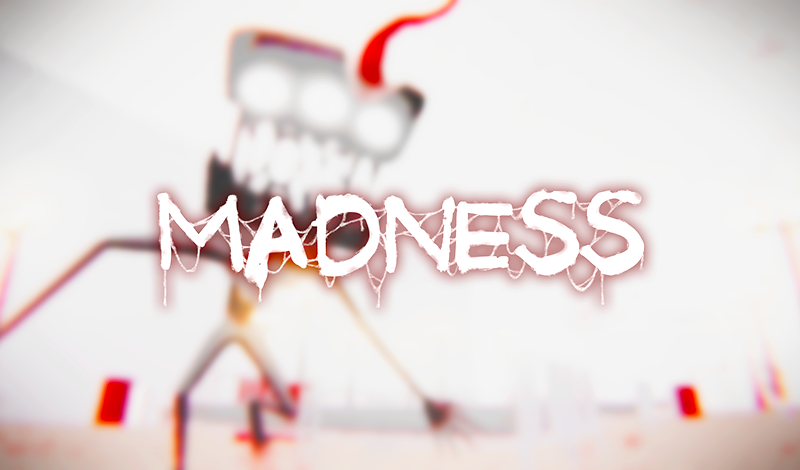
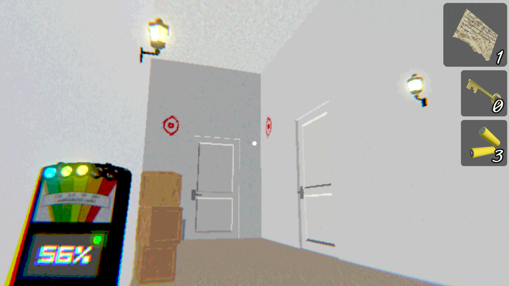
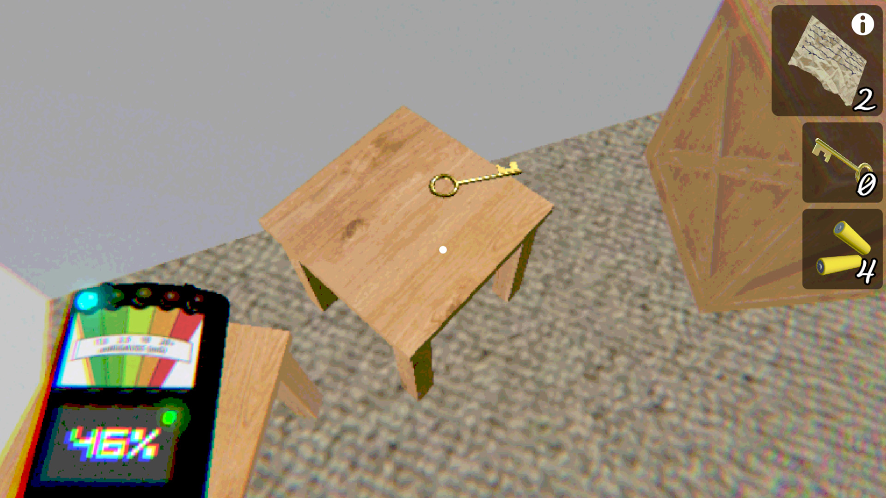
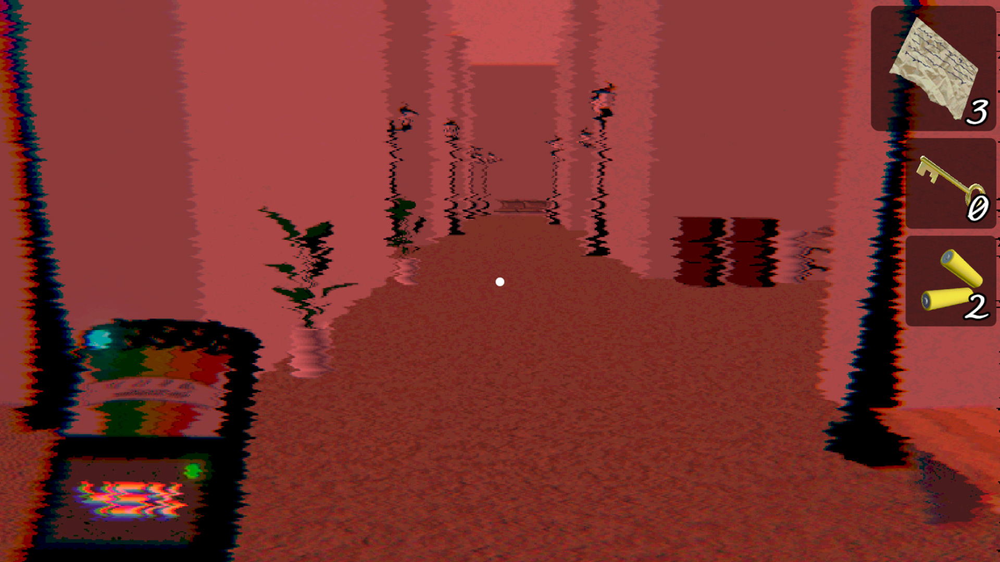
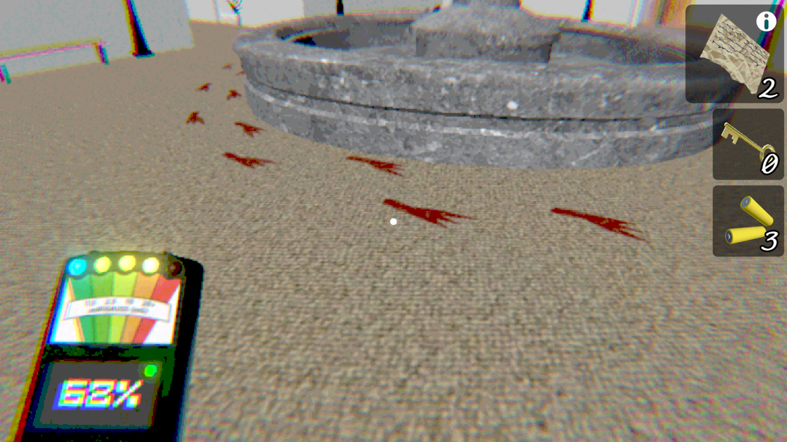
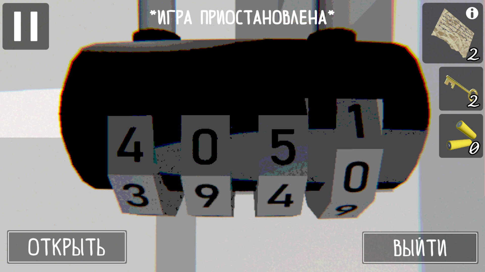

# Геймплей/Игровые механики
3D-игра от первого лица.
После запуска игры вы появляетесь в комнате одной огромной локации напоминающей лабиринт. Ваш взор настигают белые стены с высокими белыми дверьми и однотипная мебель: кровати, шкафы, стулья и т.д.
Ваша цель: выбраться из локации.
Ваши задачи: искать записки, батарейки и ключи, спасаться от существа.
#### Записки
Содержат связанные сообщения, которые постепенно открывают тяжелый занавес тайны здешнего места.
#### ЭМП/Батарейки
Батарейки необходимы для подпитки заряда устройства ЭМП.
Устройство ЭМП служит датчиком паранормальной активности, которая будет вас преследовать сводя с ума. Паранормальная активность будет сообщать вам о приближении здешнего существа, которое крайне опасно.
#### Ключи
С их помощью можно открыть запертые двери, чтобы продвигаться по локации дальше.

## Существо (Монстр)
#### Способности
* Преследование игрока.
* Завершение игры при нападении на игрока (нападение производится при критическом сокращении дистанции).
* Воспроизводение пугающих звуков.
* Повышение агрессивности, если игрок посмотрит существу в глаза.

#### Режимы
```csharp
// Monster.cs
public enum Mode
{
    None,
    AggressiveTarget,
    MaximumAggressive,
    Peaceful
}
```

#### Паранормальные события
```csharp
// MonsterEventer.cs
public enum EventType
{
    Sound, // Случайный пугающий звук (ambient)
    LampFlicker, // Нервное мигание фонарей вокруг игрока
    GlobalLightFlicker, // Мигание глобального освещения
    SceneFlicker, // Изменение освещения
    OpenDoorHingeWiggling, // Движение дверей
    DoorHandleWiggling, // Хаотичное движение ручек дверей
    RedShoePrint, // Появление кровавых призрачных следов со звуковым сопровождением
    RedEyeDrawing, // Проявление рисунков глаз на стенах
    TrashCanHand, // Воспроизведение анимации тянущийся руки монстра из ближайшего мусорного ведра
    SpawnAggressiveTarget, // Появление монстра в агрессивном состоянии
    SpawnModerateAggressive, // Появление монстра в умеренно-агрессивном состоянии
    HarmlessSpawn // Появление монстра в мирном состоянии (Существо стоит на месте)
}
```
#### Видео-демонстрация (dev log видео)
<video src="https://github.com/user-attachments/assets/5c7953f7-21a5-425f-a3ac-8a0294315528" controls="controls" style="max-width: 100%;">
</video>

## Геймплей-видео
Данное видео использовалось как промо-материал для публикации на Яндекс.Игры и по правилам платформы на тот момент, оно не содержит пугающего материала.
<video src="https://github.com/user-attachments/assets/3e483d94-27da-4ebe-b34c-df894a0d15b8" controls="controls" style="max-width: 100%;">
</video>

# Скриншоты





